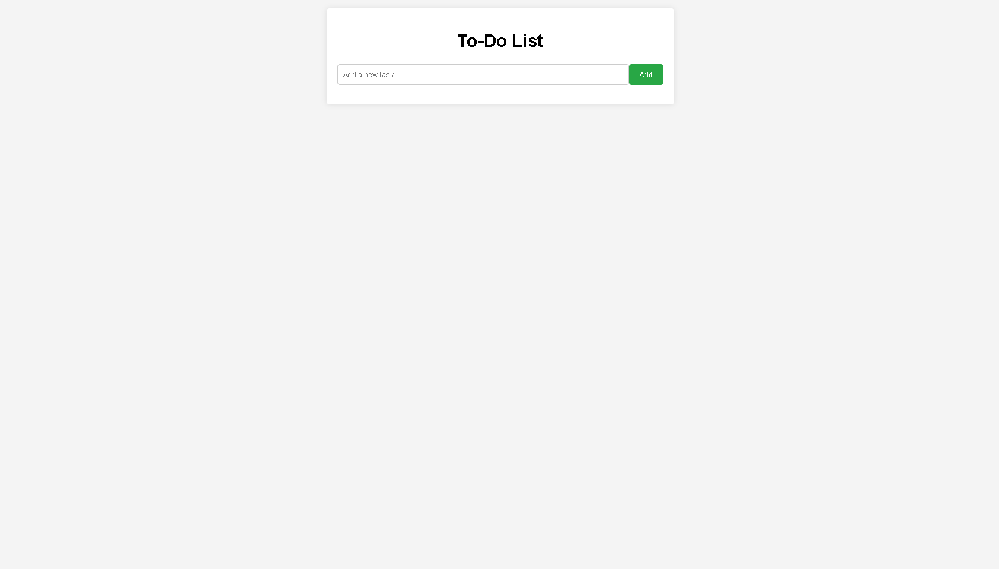

---
# 📝 To-Do List Application

Welcome to the **To-Do List Application**! This simple yet powerful app allows you to manage your tasks efficiently. Whether you're tracking daily chores, work projects, or personal goals, this app is designed to help you stay organized and productive.

---

## 🌟 Features

- **Add Tasks**: Quickly add new tasks to your to-do list.
- **View Tasks**: See all your tasks in one place.
- **Delete Tasks**: Remove completed tasks with a single click.
- **Responsive Design**: The application is mobile-friendly and looks great on any device.

---

## 📸 Demo

  
*Here’s a glimpse of how the To-Do List Application works! Add, view, and manage your tasks effortlessly.*

---

## ⚙️ Tech Stack

- **Frontend**: HTML, CSS
- **Backend**: Python, Flask
- **Storage**: In-memory storage (for simplicity)

---

## 🚀 Getting Started

Follow these steps to set up the application locally:

### 📋 Prerequisites

Make sure you have Python and Flask installed. You can install Flask using pip:

```bash
pip install Flask
```

### 📥 Clone the Repository

Clone the repository or download the zip file:

```bash
git clone https://github.com/chrohangurjar1/todo_app.git
```

### 🏃 Run the Application

Navigate to the project directory and start the Flask application:

```bash
cd todo_app
python app.py
```

The application will be running on `http://127.0.0.1:5000/`.

---

## 🤝 Contributing

Contributions are welcome! If you have suggestions or improvements, feel free to create a pull request or open an issue.

---

## 📄 License

This project is licensed under the MIT License - see the [LICENSE](LICENSE) file for details.

---
## 🌟 Contributors

We want to give a huge shoutout to everyone who has contributed to the project! 🙌 Your hard work and dedication help make this app better every day. 💪

<a href="https://github.com/chrohangurjar1/RustWeatherApp/graphs/contributors">
  
</a>

🎉 Thank you all for your amazing contributions! Let's keep building together. 🚀
---

## 📬 Contact

If you have any questions or feedback, please reach out to me:

- **Email**: your_email@example.com
- **GitHub**: [Rohan Naagar](https://github.com/chrohangurjar1)

---

Happy Tasking! 🎉
---
